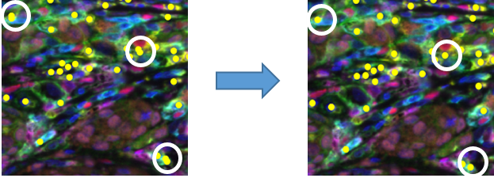

# Merge a Single Sample (MaSS)
##### 
***v.0.01.0001***

#### 
Created by: Benjamin Green1, Sneha Berry2, Elizabeth Engle2, Nicolas Giraldo3, Peter Nguyen2, Tricia Cottrell3, Janis Taube12,3, and Alex Szalay4

 
Departments of 1Dermatology, 2Oncology, 3Pathology at Johns Hopkins University SOM, the Mark Center for Advanced Genomics and Imaging, the Sidney Kimmel Comprehensive Cancer Center, and the Bloomberg~Kimmel Institute for Cancer Immunotherapy at Johns Hopkins, Baltimore, MD, USA

 
 Departments of 4Astronomy and Physics at Johns Hopkins University and IDIES, Baltimore, MD, USA
 
  
 
Individual Contributions: **Benjamin Green**: Conceptualization, Methodology, Software, Writing – Original Draft; Visualization **Sneha Berry**: Conceptualization; Validation, Visualization, Writing – Review & Editing **Liz Engle**: Conceptualization, Resources **Nicolas Giraldo-Castillo**: Conceptualization **Peter Nguyen** Conceptualization, Methodology **Tricia Cottrell** Conceptualization, Validation, Writing – Review & Editing **Janis Taube** Conceptualization, Supervision **Alex Szalay** Conceptualization, Methodology, Validation, Software

#### 
Correspondence to: bgreen42@jh.edu

## ***Section 1: Contents***
1. [Contents](#section-1-contents "Title")
2. [Summary](#section-2-summary "Title")
3. [Workflow Description](#section-3-workflow-description "Title")
4. [Merge Configuration File Structure](#section-4-merge-configuration-file-structure "Title")
5. [Image and Table File Structure](#section-5-image-and-table-file-structure "Title")
6. [Installation and how to run](#section-6-installation-and-how-to-run "Title")
7. [Output](#section-7-output "Title")
8. [Image QA QC utility](#section-8-image-qa-qc-utility "Title")

## ***Section 2: Summary***
Merge a Single Sample (MaSS) is an executable utility, written and compiled in MATLAB that facilitates the analysis of multiplex immunofluorescence imaging data. Specifically, it merges a set of binary phenotype classifications for individual markers created by the inForm® Cell Analysis (Akoya Biosciences®) phenotype module into a single coordinate system, enabling the so-called 'multipass' method for mIF cell classification. With this method each cell type is both segmented and classified separately, thereby reducing the segmentation error caused by cell size variation and decreasing the complexity of classifying high plex panels where many different coexpressions can exist. By  In order to minimize over-segmentation and reconcile different cell segmentation algorithms the code satisfies the condition that only one cell is identified within 6 pixels of another cell call, a distance that is measured between cell centers. To reconcile conflicting phenotypic classifications of the same cell, a hierarchical decision tree is used to determine which phenotypes will persist. The decision tree is embedded in the user defined [merge configuration file](#section-4-merge-configuration-file-structure "Title") along with information about the panel and pre-processing analysis. With this file and *a priori* information about the panel, the user can alter the behavior of marker interactions; specifying things like acceptable coexpressions, mutual segmentation algorithms, and even allowing multiple segmentation algorithms for a single marker. The utility was designed to run across a set of images in the [predefined folder structure](#section-5-image-and-table-file-structure "Title"). This document further details the steps involved in phenotype clean up and instructions on implementing the code.

## ***Section 3: Workflow Description***
In order to run the executable, each marker in the multiplex panel must have separate classification table. This table should be in the ‘cell segmentation data’ export format as provided by the inForm® Cell Analysis’ phenotype module. Each output for a specified marker, should have two defined phenotypes; one as the antibody name, i.e. ‘CD8’, and ‘Other’, case is not important. The data should be in the format defined [here](#section-5-image-and-table-file-structure "Title"). Tips on how to configure an InForm® Cell Analysis project for compatibility with the MaSS program are defined at the end of [Section 4](#section-4-merge-configuration-file-structure "Title") and, in more detail, the accompanying protocol document ‘inForm Phenotype (Multipass).docx’. After the data has been exported and set in the proper format the merge configuration file for the batch must be created, directions on that file is located [here](#section-4-merge-configuration-file-structure "Title"). As mentioned above, this file will help define settings for how each antibody will be treated in the hierarchical merge, it also provides the code with useful metadata like which markers are in the panel and which opal each marker is in. 

Once the data files are set up correctly, the code can be executed. The following part of this document will be used to define the logic steps taken to merge the cell data into a single coordinate system and is included for interested readers\ transparency. First, we define lineage markers and expression markers. Lineage markers, individually or in combination, are used here to define specific cell phenotypes. Expression markers are those that can be expressed on multiple cell lineages, usually at varying levels. Next a primary segmentation is defined, this segmentation is labeled as Segmentation Hierarchy: 1 in the merge cofiguration file. This segmentation should perform well on the majority of cell types featured in the panel. This is also where the ‘Other’ cell classification cell information, including x / y coordinates and intensity information, will come from. Secondary segmentation algorithms can be tailored for cells that do not segment well using the primary algorithm, i.e. larger tumor cells or machrophage. Following this all cells within 6 pixels of one another (~3um) are found. Cells without any lineage phenotype classification in a radius of 6 pixels are classified as ‘Other’, the rest of the cells in the 'Other' population are dropped. Following this, cells that are within 6 pixels of each other and are of the same type are collected. It is assumed that these are actually the same cell, so one of the cells should be removed. For these combinations, the code removes cells with lower total expression marker intensity. In the merge configuration file, cells may be designated to predominately express a specific expression marker; in this case priority is placed on that expression marker.

